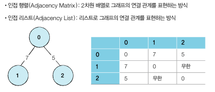
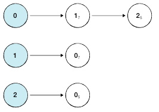

## DFS
- DFS는 깊이 우선 탐색이라고 부르며, 그래프에서 깊은 부분을 우선적으로 탐색하는 알고리즘이다.
- 특정한 경로로 탐색하다가 특정한 상황에서 최대한 깊숙이 들어가서 노드를 방문한 후, 다시 돌아가 다른 경로로 탐색하는 알고리즘이다.
- 데이터의 개수가 N개인 경우 O(N)의 시간이 소요된다는 특징

- 인접 행렬 방식은 2차원 배열에 각 노드가 연결된 형태를 기록하는 방식이다.
- 인접 행렬을 표현할 때 파이썬에서는 2차원 리스트로 구현할 수 있다.
- 연결 되지 않은 노드끼리는 무한의 비용이라고 작성한다.
- 인접 리스트 방식에서는 다음 그림처럼 모든 노드에 대한 정보를 차례대로 연결하여 저장한다.
- 인접 리스트는 *연결 리스트*라는 자료구조를 이용하여 구현하는데, 파이썬은 기본 자료형인 리스트 자료형이 append()와 메소드를 제공하므로, 전통적인 프로그래밍 언어에서의 연결과 연결 리스트의 기능을 모두 기본으로 제공한다.
- 파이썬으로 인접 리스트를 이용해 그래프를 표현하고자 할 때에도 단순히 2차원 리스트를 이용하면 된다.

- DFS는 스택 자료구조를 이용하며 구체적인 동작 과정은 다음과 같다
    1. 탐색 시작 노드를 삽입하고 방문 처리를 한다.
    2. 스택의 최상단 노드에 방문하지 않은 인접 노드가 있으면 그 인접 노드를 스택에 넣고 방문 처리를 한다. 방문하지 않은 인접 노드가 없으면 스택에서 최상단 노드를 꺼낸다.
    3. 2번의 과정을 더 이상 수행할 수 없을 때까지 반복한다.