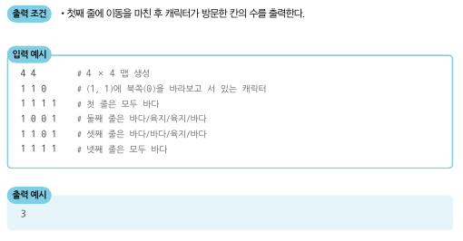

## 게임 개발
- 맵의 각 칸은 (A,B)로 나타낼 수 있고, A는 북쪽으로부터 떨어진 칸의 개수 B는 서쪽으로부터 떨어진 개수
- 캐릭터는 상하좌우로 움직일 수 있고, 바다로 되어 있는 공간에는 갈 수 없다.
- 메뉴얼
    1. 현재 위치에서 현재 방향을 기준으로 왼쪽 방향(반시계 방향으로 90도 회전한 방향)부터 차례대로 갈 곳을 정한다.
    2. 캐릭터의 바로 왼쪽 방향에 아직 가보지 않은 칸이 존재한다면, 왼쪽 방향으로 회전한 다음 왼쪽으로 한 칸을 전진한다. 왼쪽 방향에 가보지 않은 칸이 없다면, 왼쪽 방향으로 회전만 수행하고 1단계로 돌아간다.
    3. 만약 네 방향 모두 이미 가본 칸이거나 바다로 되어 있는 칸인 경우에는, 바라보는 방향을 유지한 채로 한 칸 뒤로 가고 1단계로 돌아간다. 단, 이때 뒤쪽 방향이 바다인 칸이라 뒤로 갈 수 없는 경우에는 움직임을 멈춘다.
- 캐릭터가 방문한 칸의 수를 출력하는 프로그램을 만드시오.

### 문제 해설
- 방향을 설정해서 이동하는 문제 유형은 dx, dy라는 별도의 리스트를 만들어 방향을 정하는 것이 효과적이다.
- 북쪽으로 이동하기 위해 x와 y 좌표를 각각 dx[0], dy[0] 만큼 더한다