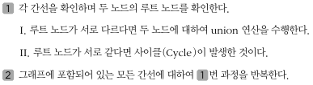

## 서로소 집합
- 수학에서 서로소 집합이란 공통 원소가 없는 두 집합을 의미한다.
- 서로소 집합 자료구조란 서로소 부분 집합들로 나누어진 원소들의 데이터를 처리하기 위한 자료구조이다.
- 서로소 집합 자료구조는 union(합집합)과 find(찾기)이 2개의 연산으로 조작할 수 있다.
- 서로소 집한 자료구조는 union-find(합치기 찾기) 자료구조라고 불리기도 한다.

### 서로소 집합 자료구조
- 서로소 집합 자료구조를 구현할 때는 트리 자료구조를 이용하여 집합을 표현하는데, 서로소 집합 정보(합집합 연산)가 주어졌을 때 트리 자료구조를 이용해서 집합을 표현하는 서로소 집합 계산 알고리즘은 다음과 같다.

    

- 부모 행렬을 따로 설정하여 저장한다.
- 경로 압축을 통해 find 시간을 줄일 수 있다.