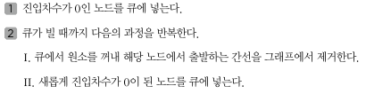

## 위상 정렬
- 위상 정렬은 순서가 정해져 있는 일련의 작업을 차례대로 수행해야 할 때 사용할 수 있는 알고리즘이다.
- 위상 정렬이란 방향 그래프의 모든 노드를 '방향성에 거스르지 않도록 순서대로 나열하는 것'이다.
- 현실세계에서 위상 정렬을 수행하게 되는 전형적인 예시로는 '선수과목을 고려한 학습 순서 설정'을 들 수 있다.
- 위상 정렬 알고리즘을 자세히 살펴보기 전에, 먼저 진입차수를 알아야한다. 진입 차수란 특정한 노드로 들어오는 간선의 개수를 의미한다.
- 위상 정렬 알고리즘은 다음과 같다.

    

- 위상 정렬의 시간 복잡도는 O(V+E)이다.
