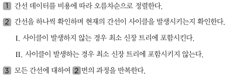

## 크루스칼 알고리즘
- 신장 트리 중에서 최소 비용으로 만들 수 있는 신장 트리를 찾는 알고리즘을 '최소 신장 트리 알고리즘'이라고 한다.
- 대표적인 최소 신장 트리 알고리즘이 크루스칼 알고리즘이다.
- 크루스칼 알고리즘을 사용하면 가장 적은 비용으로 모든 노드를 연결할 수 있는데, 그리디 알고리즘으로 분류된다.
- 먼저 모든 간선에 대하여 정렬을 수행한 뒤에 가장 거리가 짧은 간선부터 집합에 포함시키면 된다. 이때 사이클을 발생시킬 수 있는 간선의 경우, 집합에 포함시키지 않는다.
- 최종적으로 신장 트리에 포함되는 간선의 개수가 **노드의 개수 -1**과 같다는 특징이 있다.

    

- 크루스칼 알고리즘은 간선의 개수가 E개일 때, O(ElogE)의 시간 복잡도를 갖는다.