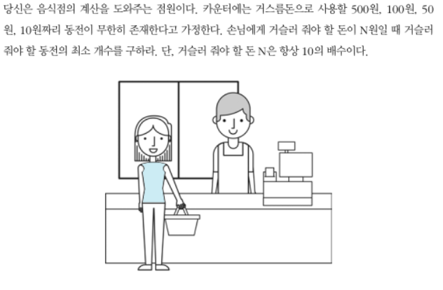

## 거스름돈
- 그리디 알고리즘을 대표하는 문제
- 금액이 **배수**형태인 경우만 그리드로 풀수 있음

### 문제 해설
- 가장 큰 화폐 단위부터 돈을 거슬러 주는 것
- 화폐의 종류가 K개라고 할 때, O(K)의 시간 복잡도
- 가지고 있는 동전 중에서 큰 단위가 항상 작은 단위 **배수**이므로 작은 단위의 동전들을 종합해 다른 해가 나올수가 없다