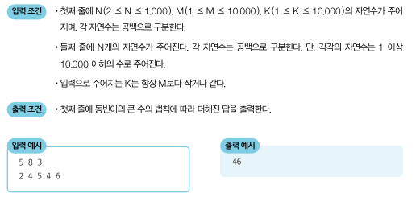

## 큰 수의 법칙

### 문제 해설
- 가장 큰 수, 2번째로 큰 수를 뽑음
- 가장 큰 수를 K번만큼 더하고, 2번째로 작은 수를 한 번 더하는 연산을 반복
- 가장 큰 수는 int(M / (K+1)) * K + M % (K + 1) 번 만큼 더해짐
- 2번째로 큰 수는 M - int(M / (K+1)) * K + M % (K + 1) 만큼 더해짐