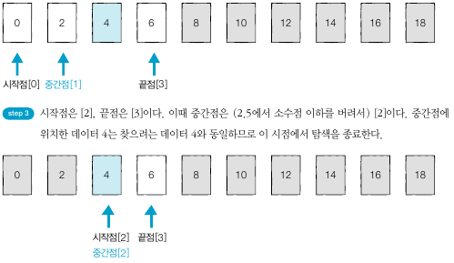

## 이진 탐색
- 이진 탐색은 배열 내부의 데이터가 정렬되어 있어야만 사용할 수 있는 알고리즘이다.
- 이진 탐색은 위치를 나타내는 변수 3개를 사용하는데 탐색하고자 하는 범위의 시작점, 끝점 그리고 중간점이다.
- 찾으려는 데이터와 중간점 위치에 있는 데이터를 반복적으로 비교해서 원하는 데이터를 찾는 게 이진 탐색 과정이다.
- 중간점이 실수일 때는 소수점 이하를 버린다.
- 이진 탐색은 한 번 확인할 때마다 확인하는 원소의 개수가 절반씩 줄어든다는 점에서 시간 복잡도가 O(logN)이다.

      

      

