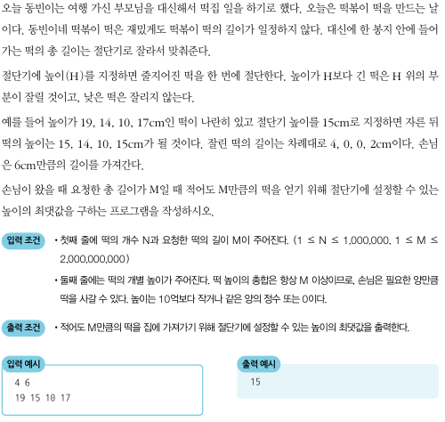

## 떡볶이 떡 만들기

      

- 전형적인 이진 탐색 문제이자, 파라메트릭 서치 유형의 문제이다.
- 파라메트릭 서치는 최적화 문제를 결정 문제로 바꾸어 해결하는 기법이다.
- 적절한 높이를 찾을 때까지 절단기의 높이 H를 반복해서 조정하는 것이다.
- 절단기의 높이는 1부터 10억까지의 정수 중 하나인데, 이처럼 큰 수를 보면 당연히 이진 탐색부터 떠올려야 된다.