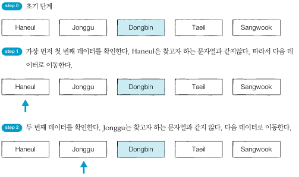
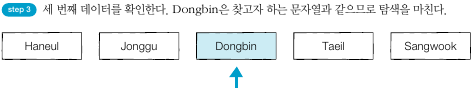

## 순차 탐색
- 순차 탐색이란 리스트 안에 있는 특정한 데이터를 찾기 위해 앞에서부터 데이터를 하나씩 차례대로 확인하는 방법이다.
- 보통 정렬되지 않은 리스트에서 데이터를 찾아야 할 때 사용한다.
- 리스트 내에 데이터가 아무리 많아도 시간만 충분하다면 항상 원하는 원소를 찾을 수 있다는 장점이 있다.
- 시간 복잡도는 O(N)이다.

      

      

