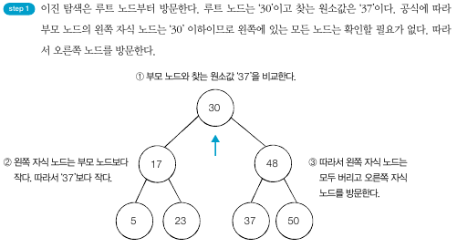
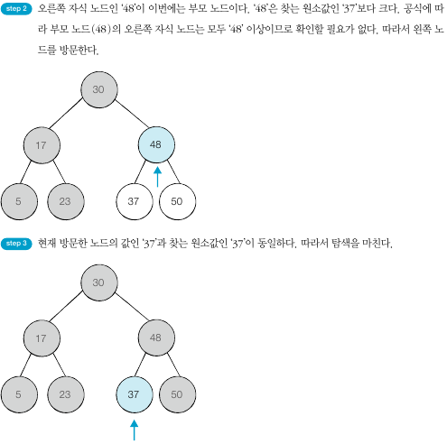

## 트리 자료구조
- 트리는 부모 노드와 자식 노드의 관계로 표현된다.
- 트리의 최상단 노드를 루트 노드라고 한다.
- 트리의 최하단 노드를 단말 노드라고 한다.
- 트리에서 일부를 떼어내도 트리 구조이며 이를 서브 트리라고 한다.
- 트리는 파일 시스템과 같이 계층적이고 정렬된 데이터를 다루기에 적합하다.

### 이진 탐색 트리
- 이진 탐색 트리란 이진 탐색이 동작할 수 있도록 고안된, 효율적인 탐색이 가능한 자료구조이다.
- 부모 노드보다 왼쪽 자식 노드가 작다.
- 부모 노드보다 오른쪽 자식 노드가 크다.
- 왼쪽 자식 노드 < 부모노드 < 오른쪽 자식 노드가 성립한다.

      

      

