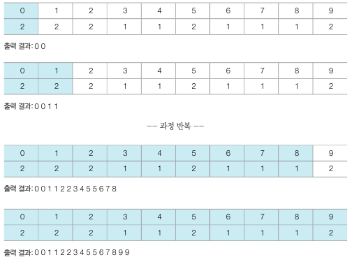

## 계수 정렬
- 계수 정렬은 특정한 조건이 부합할 때만 사용할 수 있지만 매우 빠른 정렬 알고리즘
- 데이터의 크기 범위가 제한되어 정수 형태로 표현할 수 있을 때만 사용할 수 있다.
- 일반적으로 가장 큰 데이터와 가장 작은 데이터의 차이가 1,000,000을 넘지 않을 때 효과적으로 사용할 수 있다.
- 모든 범위를 담을 수 있는 크기의 리스트를 선언해야 한다. 예를 들어 가장 큰 데이터와 가장 작은 데이터의 차이가 1,000,000이라면 총 1,000,001개의 데이터가 들어갈 수 있는 리스틀 초기화해야 한다.
- 처음에는 모든 리스트의 값을 0으로 초기화 한다.
- 시간 복잡도는 데이터의 개수를 N, 데이터 중 최대값의 크기를 K라고 할 때, O(N + K)이다.
- 공간 복잡도는 O(N + K)이다.

      

      

