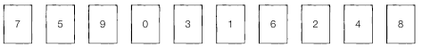
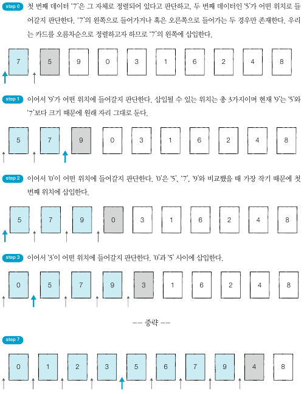
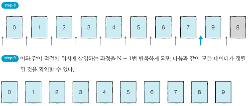

## 삽입 정렬
- 삽입 정렬은 특정한 데이터를 적절한 위치에 '삽입'한다는 의미에서 **삽입 정렬**
- 삽입 정렬은 두 번째 데이터부터 시작한다. 왜냐하면 첫 번째 데이터는 그 자체로 정렬되어 있다고 판단한다.
- 삽입 정렬은 필요할 때만 위치를 바꾸므로 '데이터가 거의 정렬되어 있을 때' 효율적
- 삽입 정렬은 정렬이 이루어진 원소는 항상 오름차순을 유지하고 있다는 특정이 있다.
- 시간 복잡도는 O(N2)이지만, 리스트의 데이터가 거의 정렬된 상태라면 매우 빠르게 동작한다.

      

   

   

