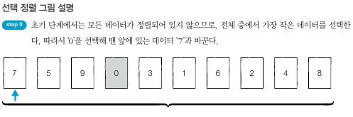
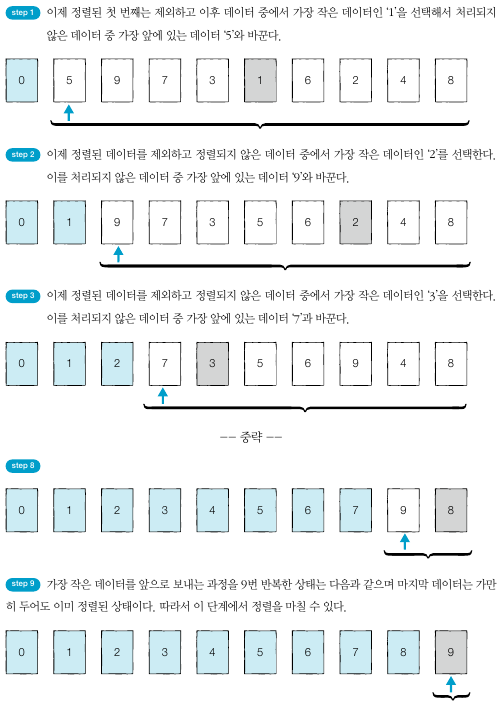

## 선택정렬
- 가장 작은 데이터를 선택해 맨 앞에 있는 데이터와 바꾸고, 그다음 작은 데이터를 선택해 앞에서 두 번째 데이터와 바꾸는 과정을 반복한다.
- 가장 원시적인 방법으로 매번 '가장 작은 것을 선택'한다는 의미에서 **선택 정렬** 알고리즘
- N - 1번 만큼 가장 작은 수를 찾아서 맨 앞으로 보내야 한다. 또한 매번 가장 작은 수를 찾기 위해 비교 연산이 필요하다.
- 연산 횟수는 N + (N-1) + (N-2) + ... + 2다. 따라서 근사치 **N*N(+1)/2**번의 연산을 수행한다
- 시간 복잡도는 O(N2)

      

   

