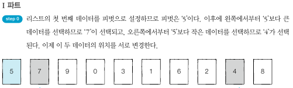
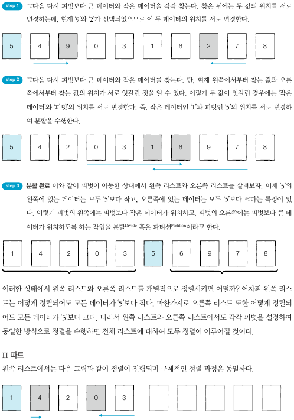
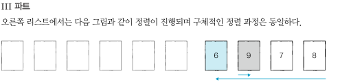

## 퀵 정렬
- 퀵 정렬은 정렬 알고리즘 중에서 가장 많이 사용되는 알고리즘
- 퀵 정렬은 기준을 설정한 다음 큰 수와 작은 수를 교환한 후 리스트를 반으로 나누는 방식으로 동작
- 퀵 정렬에서는 피벗이 사용된다. 큰 수와 작은 수를 교환할 때, 교환하기 위한 '기준'을 **피벗**이라고 표현한다.
- 피벗을 설정하고 리스트를 분할하는 방법에 따라서 여러가지 퀵 정렬을 구분하는데, 가장 대표적인 방식은 호어 분할 방식
   1. 리스트에서 첫 번째 데이터를 피벗으로 정한다.
   2. 피벗을 설정한 뒤에는 왼쪽에서부터 피벗보다 큰 데이터를 찾고, 오른쪽에서부터 피벗보다 작은 데이터를 찾는다.
   3. 큰 데이터와 작은 데이터의 위치를 서로 교환한다.
- 퀵 정렬은 전체 3개의 파트로 나눠서 보는게 편하다.
- 재귀함수로 이루어 지는데, 종료조건은 현재 리스트의 원소가 1개인 경우에 종료한다.
- 퀵 정렬의 평균 시간 복잡도는 O(NlogN)이다.최악의 경우 동일하게 O(N2)이다.

      

   

   

