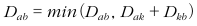

## 플로이드 워셜 알고리즘
- 플로이드 워셜 알고리즘은 **모든 지점에서 다른 모든 지점까지의 최단 경로를 모두 구해야하는 경우** 사용할 수 있는 알고리즘이다.
- 노드의 개수가 N개일 때 알고리즘상으로 N번의 단계를 수행하며, 단계마다 O(N2)의 연산을 통해 '현재 노드를 거쳐가는' 모든 경로를 고려한다. 따라서 총 시간 복잡도는 O(N3)이다.
- 플로이드 워셜 알고리즘은 2차원 리스트에 '최단 거리' 정보를 저장한다는 특징이 있다.
- 플로이드 워셜 알고리즘은 다이나믹 프로그래밍이라는 특징이 있으며 노드의 개수가 N이라고 할 때, N번 만큼의 단계를 반복하며 점화식에 맞게 2차원 리스트를 갱신하기 때문이다.
- A에서 B로 가는 점화식은 다음과 같다. 'A에서 B로 가는 최소 비용'과 'A에서 K를 거쳐 B로 가는 비용'을 비교하여 더 작은 값으로 갱신하겠다는 의미이다.

    

